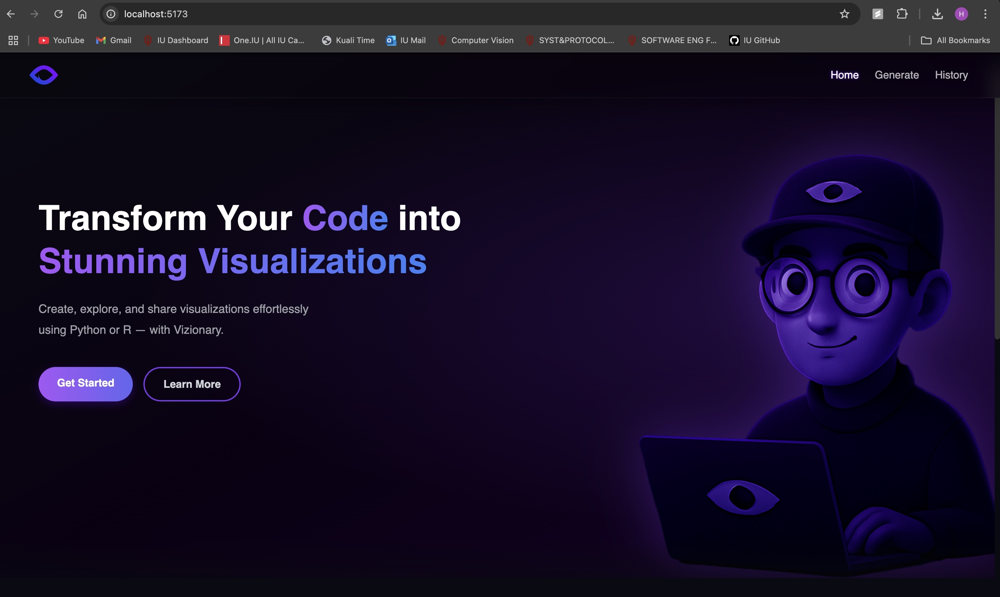
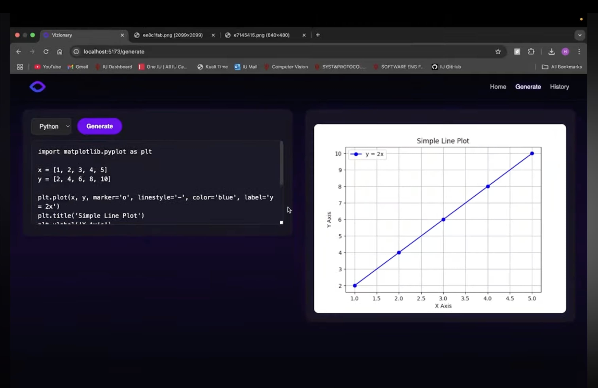
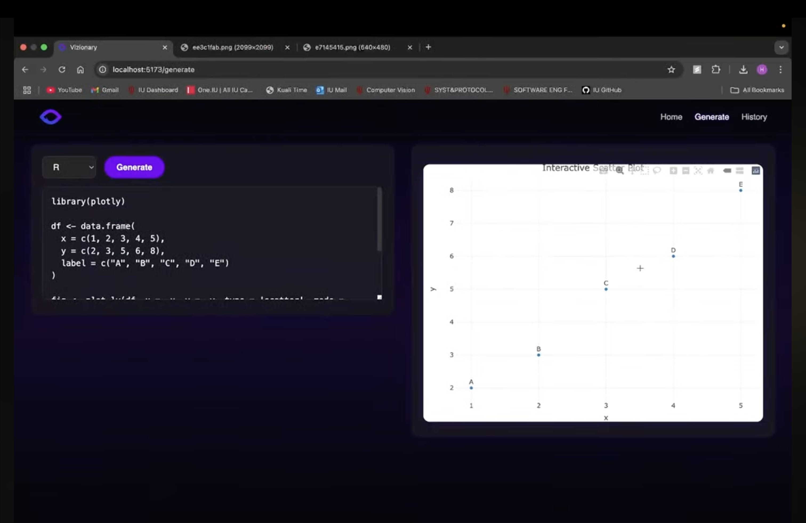
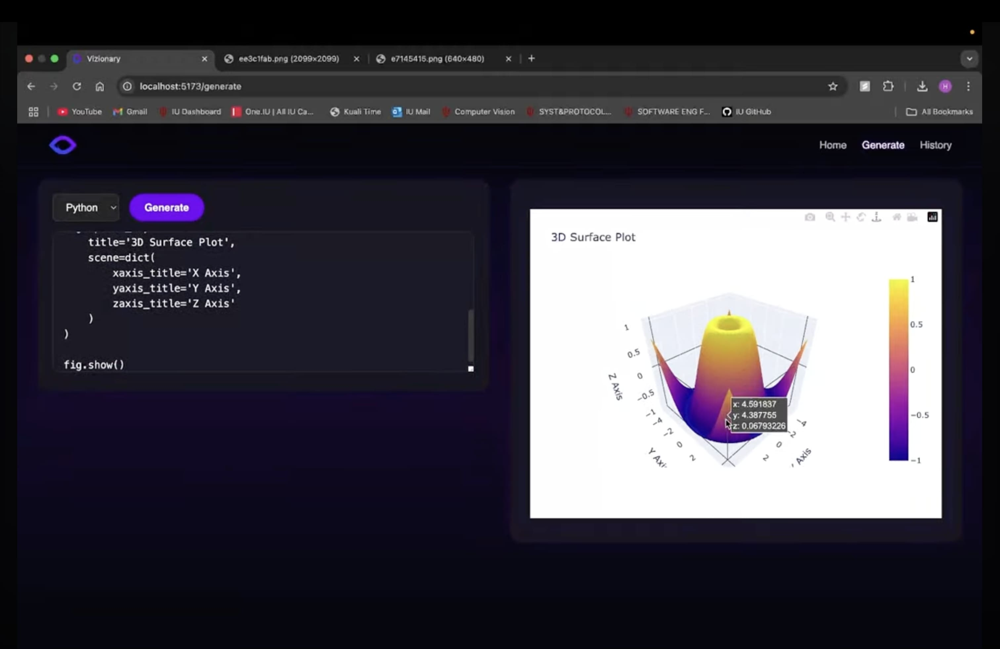
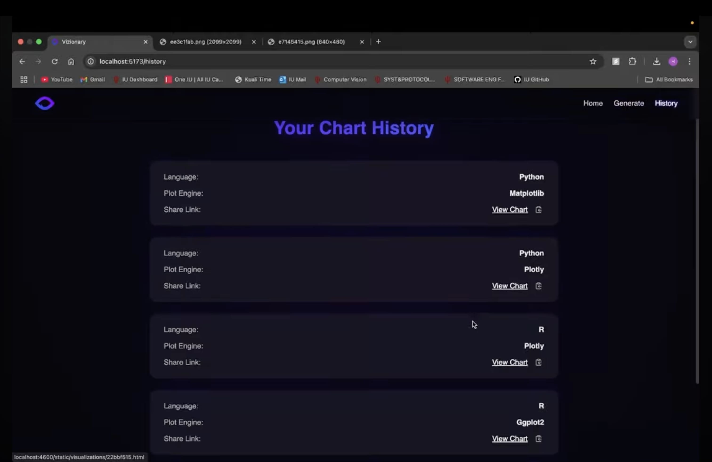

# **Vizionary - README** 🎨🚀






**Vizionary** is a powerful, interactive web platform that lets users write, execute, and visualize Python and R code directly in the browser. It uses secure Docker containers for backend execution and features a sleek React-based frontend for smooth user experience.

---

## **Table of Contents** 📚

- [Project Overview](#project-overview)
- [Frontend](#frontend)
- [Backend](#backend)
- [How It Works](#how-it-works)
- [Getting Started](#getting-started)
- [Technologies Used](#technologies-used)
- [Contributing](#contributing)
- [License](#license)

---

## **Project Overview** 🖥️

Vizionary offers a VS Code-style environment where users can:
- Write Python or R code.
- Choose the appropriate visualization library.
- Generate and view interactive or static charts instantly.

The application ensures that each visualization is generated in a fresh, isolated container environment for safety and consistency.

---

## **Frontend** 🌐

The frontend is built using **React** and **Tailwind CSS**, giving users:
- A code editor interface styled like VS Code.
- A dropdown for selecting programming language and libraries.
- Buttons to submit code and view live-generated plots.

### Key Features ✨:
- **Live Code Editor** with syntax highlighting.
- **Drag & Drop Upload** and clean UX.
- **Auto-Refresh** and responsive chart rendering.

---

## **Backend** 🔧

The Flask backend is designed for security and modularity:
- Executes code inside **isolated Docker containers** (Python and R).
- Handles temp file cleanup after each execution.
- Appends proper `save()` instructions to ensure consistent output.
- Returns plot URLs for direct use in frontend.

### Key Features ⚡:
- **Dockerized Execution** with image rebuilds only when needed.
- **Dynamic File Mounting** for per-request code injection.
- **Stateless Execution** for max scalability and security.

---

## **How It Works** 🔄

1. **User writes code** in the web editor.
2. **Submits it via frontend**, specifying language.
3. Backend:
    - Creates a temp `.py` or `.R` file.
    - Appends saving logic.
    - Mounts code + output volume into Docker container.
4. Docker container executes and outputs a PNG/HTML file.
5. Flask returns the file path to the frontend for rendering.

---

## **Problems Encountered and Solutions** ✏️

- **Problem**: Users may not manually save plots, or may use different figure variables (`fig`, `plt`, etc.)
- **Solution**: Backend auto-detects the engine (`matplotlib`, `plotly`, etc.) and appends the correct save command to the script.
- **Problem**: Scripts or output could accumulate.
- **Solution**: Temp folders are wiped after every execution to keep the environment clean.

---

## **Getting Started** 🏁

### Prerequisites:
- Docker 🐋
- Python 3.8+
- Node.js 18+

---

### 🧪 Local Setup

```bash
git clone https://github.com/yourusername/vizionary.git
cd vizionary
```

#### Frontend

```bash
cd client
npm install
npm run dev
```

#### Backend

```bash
cd server
pip install -r Docker/requirements.txt
python app.py
```

#### Docker Build (On-demand per call)

No need to keep long-running containers. Docker builds automatically for each code execution request.

---

## **Technologies Used** 🧰

### Frontend:
- React + Vite ⚛️
- Tailwind CSS 🎨
- Framer Motion 💫

### Backend:
- Python + Flask 🐍
- R + ggplot2 📉
- Docker 🐳

---

## **Contributing** 🤝

We welcome contributions!

1. Fork the repo.
2. Create a new branch: `feature/my-feature`
3. Submit a PR and describe your changes.

---

## **License** 📝

MIT License. See `LICENSE` file for full terms.
